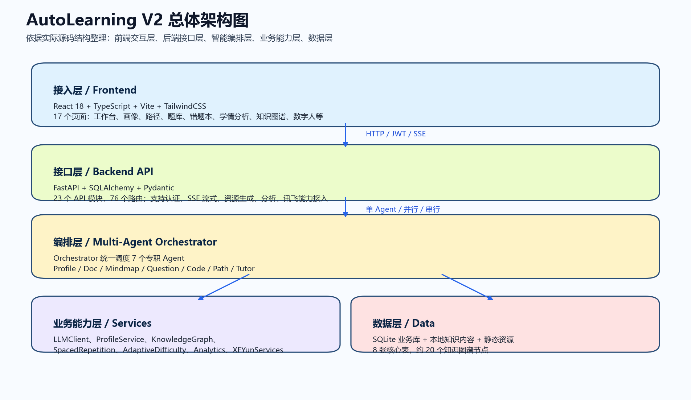
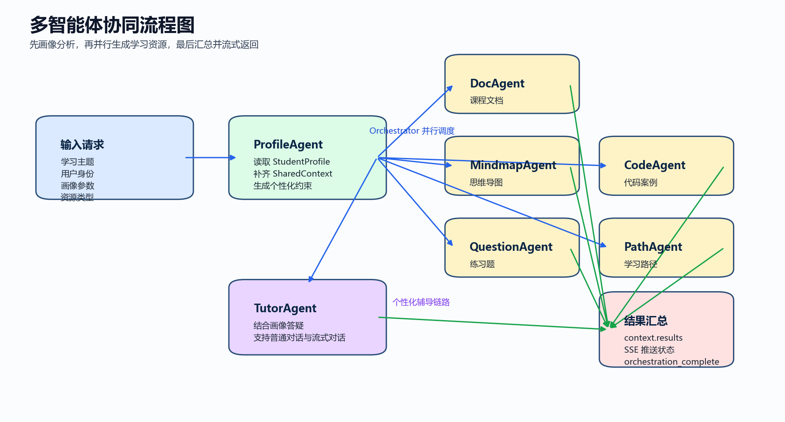
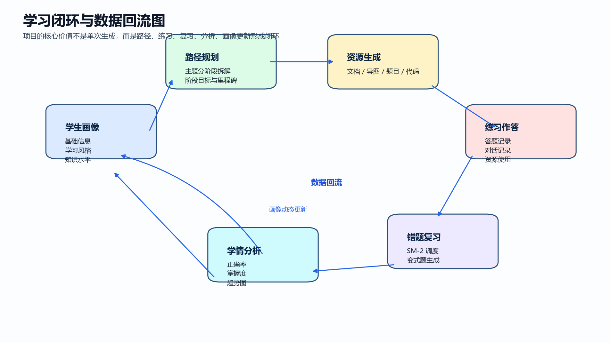
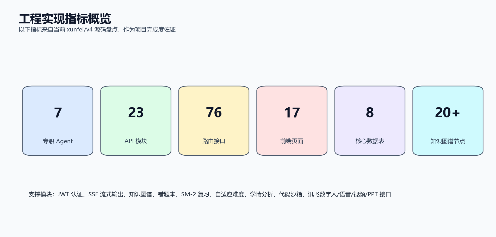

# 项目书软件工程文档版

## 文档信息

| 项目项 | 内容 |
|---|---|
| 项目名称 | AutoLearning V2 |
| 文档名称 | 标准软件工程文档版项目书 |
| 项目版本 | xunfei/v4 |
| 项目定位 | 基于多智能体协同与讯飞生态的个性化智能学习平台 |
| 适用场景 | 软件杯参赛材料、项目答辩材料、软件工程展示材料 |
| 编制日期 | 2026年6月 |
| 编制状态 | 完整版 |

## 编写说明

本版本不是对上一版参赛项目书的简单润色，而是参考公开可获得的竞赛项目书要求、作品设计与开发文档写法、软件工程课程文档模板后，重构形成的标准软件工程文档版。

本版本重点吸收了三类优秀写法：

1. 竞赛材料强调“项目价值、场景问题、创新亮点、成果可展示”。
2. 开发文档强调“需求分析、总体设计、详细设计、数据设计、测试验证”。
3. 软件工程模板强调“结构完整、逻辑闭环、图表支撑、事实可核验”。

因此，本项目书的写法不再只突出宣传性描述，而是坚持两条原则：

- 所有核心表述都尽量回到源码中已经实现的真实能力。
- 所有关键结论都尽量用模块结构、流程图、指标表和业务闭环来支撑。

## 1. 引言

### 1.1 项目背景

当前高校课程学习平台与通用 AI 问答工具之间存在明显断层。一类系统擅长提供课程资源，但内容静态、路径固定、个性化不足；另一类系统擅长即时问答，但难以覆盖学习路径规划、练习组织、错题复习、能力分析与长期追踪。学生在实际学习过程中仍然需要在资料、习题、知识结构、答疑工具和总结反馈之间频繁切换。

随着大模型、多模态交互和智能体协作技术的发展，学习平台具备了从“单轮问答工具”向“全过程学习支持系统”升级的条件。AutoLearning V2 正是在这一背景下提出，目标是围绕学生真实学习闭环构建一套 AI Native 个性化学习平台。

### 1.2 编写目的

本文件用于系统化说明 AutoLearning V2 的问题定义、需求分析、系统架构、关键实现、数据设计、测试验证与创新特色，使评审、指导教师与技术读者能够快速理解项目的工程完整性与实际落地程度。

### 1.3 项目目标

- 面向高校学生和自学者，提供画像驱动的个性化学习支持。
- 以多智能体协同方式生成文档、导图、习题、代码案例与学习路径。
- 建立练习、错题、复习、分析、答疑之间的数据闭环。
- 接入讯飞数字人、语音、视频、PPT 等多模态能力，提升交互与展示形式。

## 2. 搜索材料提炼与写作原则

### 2.1 搜索材料中的优秀内容提炼

结合前期检索到的公开资料，可以归纳出与本项目书撰写最相关的优秀内容：

| 来源类型 | 可借鉴内容 | 在本项目书中的落地方式 |
|---|---|---|
| 竞赛通知与作品要求 | 先讲项目价值，再讲方案和成果，避免空泛技术堆砌 | 在前部先交代痛点、定位、目标用户和场景价值 |
| 作品设计与开发文档规范 | 用架构图、流程图、功能分解图说明系统，不只写文字描述 | 增加总体架构图、多智能体流程图、学习闭环图 |
| 软件工程模板 | 要求需求、设计、数据库、测试、部署、风险等章节完整 | 将文档改造成标准软件工程结构 |
| 优秀参赛材料通用写法 | 指标量化、边界诚实、创新点与可行性并重 | 使用真实工程指标，并明确说明演示降级与当前不足 |

### 2.2 写作原则

本项目书按照以下原则组织：

1. 先业务问题，后技术实现。
2. 先总体结构，后模块细节。
3. 先真实能力，后创新总结。
4. 先展示闭环，再展示单点功能。
5. 对尚未完全产品化的部分明确说明边界，不夸大。

### 2.3 与统一模板的关系

公开检索结果中未发现一份可直接套用的“中国软件杯统一项目书官方 docx 模板”。因此，本版本采用“竞赛导向 + 软件工程导向”的融合方式：既满足参赛评审快速阅读，又满足工程文档的逻辑完整性。

## 3. 项目概述

### 3.1 项目定位

AutoLearning V2 是一套面向高校学生与自主学习者的个性化智能学习平台。系统不是单纯的题库系统，也不是普通的问答机器人，而是围绕“学什么、怎么学、怎么练、怎么改、怎么评”五个核心问题构建的闭环学习系统。

### 3.2 核心价值

- 用学生画像驱动个性化资源生成，而不是统一模板输出。
- 用多智能体协同完成任务分工，而不是单模型一次性生成全部内容。
- 用学习过程数据持续修正路径与难度，而不是停留在单次生成。
- 用知识图谱、错题复习和学情分析让学习支持具备结构性和持续性。
- 用讯飞多模态能力增强答疑、展示与互动的沉浸感。

### 3.3 目标用户

| 用户类型 | 主要需求 |
|---|---|
| 高校学生 | 系统化学习专业课程、掌握知识结构、完成阶段训练 |
| 自学者 | 获得清晰的学习路径、练习内容与智能辅导 |
| 教师与指导者 | 快速生成课程讲解、导图、示例代码和分析材料 |
| 参赛展示场景 | 通过数字人、视频、PPT 等形式强化成果演示 |

### 3.4 业务问题定义

项目聚焦解决以下四类问题：

1. 学习资源静态，无法适配不同学生水平与目标。
2. 学习路径、练习、错题、复习、分析相互割裂，缺少闭环。
3. AI 工具只解决“回答一个问题”，难以持续支撑学习全过程。
4. 多模态能力常被当作展示功能，没有真正嵌入学习业务流程。

## 4. 需求分析

### 4.1 功能需求

结合当前源码实现，系统核心功能包括：

| 功能域 | 主要能力 |
|---|---|
| 用户与权限 | 用户注册、登录、JWT 认证、角色区分、管理员能力 |
| 学生画像 | 画像创建、编辑、查询、维度展示、对话后自动更新 |
| 智能答疑 | 普通对话、流式对话、历史记录、画像驱动解释策略 |
| 资源生成 | 课程文档、思维导图、练习题、代码案例、扩展阅读、评估报告 |
| 学习路径 | 主题拆解、阶段目标、路径状态、阶段进度跟踪 |
| 题库与错题 | 题目生成、作答记录、错题查询、总结报告、邮件发送 |
| 复习强化 | 基于 SM-2 的间隔重复调度、变式题生成 |
| 知识图谱 | 前置知识查询、学习顺序推荐、Mermaid 图导出 |
| 学情分析 | 正确率、时长、知识点掌握度、趋势、薄弱维度分析 |
| 代码实践 | Python 代码在线运行沙箱 |
| 多模态扩展 | 讯飞数字人、TTS、STT、视频生成、PPT 报告生成 |

### 4.2 非功能需求

- 交互实时性：支持 SSE 流式输出，让用户看到生成过程。
- 模块可扩展性：新增 Agent 或新增服务时不破坏整体结构。
- 可维护性：前后端分层清晰，业务逻辑集中在服务层。
- 可部署性：支持本地部署与 Docker 部署。
- 稳定性：在大模型或外部服务异常时具备一定降级能力。
- 安全性：支持密码哈希、认证鉴权、基础危险操作拦截。

### 4.3 典型使用场景

1. 学生填写画像后输入“机器学习入门”，系统生成路径、文档、导图、练习题与代码示例。
2. 学生完成题目训练后，系统根据答题数据形成错题集、推荐复习计划并更新学情看板。
3. 学生就具体知识点提问，TutorAgent 根据画像与知识水平给出更适配的解释。
4. 展示场景下，系统通过讯飞数字人、语音和视频能力增强交互效果。

## 5. 总体设计

### 5.1 设计思路

系统采用“前端交互层 - 后端接口层 - 智能编排层 - 业务服务层 - 数据层”的分层设计，将画像、资源、练习、分析、复习与多模态能力统一组织到一个可扩展平台中。

### 5.2 技术路线

| 层次 | 技术选型 |
|---|---|
| 前端 | React 18、TypeScript、Vite、TailwindCSS |
| 可视化 | Recharts、Markmap、KityMinder |
| 后端 | FastAPI、Uvicorn、SQLAlchemy、Pydantic |
| 认证 | JWT、bcrypt |
| 主模型通道 | DeepSeek |
| 备用模型通道 | 讯飞星火 |
| 数据存储 | SQLite，Redis 可选 |
| 多模态能力 | 讯飞数字人、语音识别、语音合成、视频、PPT |

### 5.3 总体架构图

### 5.4 架构说明

- 接入层负责页面交互、数据展示和用户操作承载。
- 接口层负责 REST 接口、SSE 输出、权限控制与请求组织。
- 编排层以 Orchestrator 为核心，负责单 Agent、并行和串行三种执行模式。
- 服务层负责画像、知识图谱、复习调度、自适应难度、学情分析和讯飞能力封装。
- 数据层负责业务数据持久化与轻量知识内容组织。

### 5.5 模块构成

| 维度 | 工程事实 |
|---|---|
| 多智能体数量 | 7 个专职 Agent |
| 后端 API 模块 | 23 个 |
| 路由接口数量 | 76 个 |
| 前端页面数量 | 17 个 |
| 核心业务数据表 | 8 张 |
| 机器学习知识图谱节点 | 约 20 个 |

## 6. 详细设计

### 6.1 多智能体协同设计

系统围绕 7 个专业 Agent 构建：

| Agent | 职责 |
|---|---|
| ProfileAgent | 分析学生画像并构建上下文 |
| DocAgent | 生成课程文档 |
| MindmapAgent | 生成思维导图 |
| QuestionAgent | 生成练习题 |
| CodeAgent | 生成代码案例 |
| PathAgent | 规划学习路径 |
| TutorAgent | 进行个性化答疑辅导 |

这些 Agent 由统一抽象基类派生，并通过 Orchestrator 统一注册与调度，从而保证职责边界清晰、流程可扩展。

### 6.2 编排机制设计

Orchestrator 支持三种运行模式：

1. `run_single`：适用于单类资源生成或单一任务执行。
2. `run_parallel`：适用于文档、导图、练习题、代码案例等资源并行生成。
3. `run_sequential`：适用于存在前后依赖的链式执行。

在“生成全套学习资源”的主流程中，系统先执行 ProfileAgent，随后并行触发 DocAgent、MindmapAgent、QuestionAgent、CodeAgent，最终汇总结果并通过 SSE 实时推送给前端。

### 6.3 学生画像设计

学生画像是本项目个性化能力的基础。系统记录的信息包括：

- 基本信息：姓名、年龄、年级、学校、专业。
- 学习信息：学习风格、知识水平、学习目标。
- 维度信息：知识掌握、学习态度、实践能力、理解深度、学习效率、进步速度等。
- 动态信息：兴趣点、薄弱点、优势项与偏好变化。

系统不仅支持手动填写画像，还支持在对话结束后调用画像服务进行结构化提取，将兴趣、薄弱点、优势项等增量更新到画像数据中，形成“交互越多，理解越准”的动态机制。

### 6.4 路径规划与知识图谱设计

PathAgent 与 KnowledgeGraph 服务共同承担学习路径规划能力。知识图谱采用轻量级有向无环图实现，内置约 20 个机器学习知识节点，并维护前置依赖关系。系统支持：

- 获取目标知识点的前置依赖。
- 基于拓扑排序生成建议学习顺序。
- 获取相关知识点与类别信息。
- 导出 Mermaid 图谱代码用于展示。

这种设计让学习路径不再只依赖人工经验，而是具备结构化依据。

### 6.5 题库、错题与复习设计

系统围绕练习训练建立了完整的学习强化链路：

1. 根据学习路径阶段生成题目。
2. 记录答题结果、作答耗时、正确性与知识点。
3. 根据错误记录沉淀错题本。
4. 调用 SM-2 间隔重复算法生成复习计划。
5. 在需要时为原题生成同知识点、同难度的变式题。

其中，SM-2 调度表会记录 `ease_factor`、`interval`、`repetitions`、`next_review` 等关键字段，使复习不再停留在“做错了就再看一遍”，而是具备长期记忆强化逻辑。

### 6.6 自适应难度设计

系统基于答题正确率、答题时长、样本数量和题目难度，计算某知识点的推荐难度等级。其基本策略为：

- 正确率高且答题速度快时，提高推荐难度。
- 正确率较低时，降低难度以巩固基础。
- 样本数量不足时，降低推荐置信度并提示继续积累数据。

这种设计使题目组织更贴近学生真实水平，而不是固定按题库难度顺序推送。

### 6.7 学情分析设计

LearningAnalyticsService 对用户学习数据进行聚合分析，当前主要覆盖：

- 总答题量与总体正确率。
- 各题型正确率与各难度正确率。
- 学习时长估算。
- 知识点掌握度。
- 最近 30 天学习趋势。
- 薄弱维度分析。
- 学习路径进度。
- 对话使用情况统计。

前端通过图表、热力图、雷达图等方式展示分析结果，使平台从“生成工具”扩展为“学习反馈系统”。

### 6.8 多模态能力设计

系统已封装的讯飞能力包括：

- 星火大模型备用通道。
- 数字人会话接口。
- 语音识别接口。
- 语音合成接口。
- 视频生成接口。
- PPT 报告生成接口。

需要明确说明的是：后端已经具备真实的讯飞接口接入逻辑；为了保证演示稳定性，前端数字人页面保留了部分演示与降级处理逻辑。这种设计是工程上对“真实能力”和“展示稳定性”之间平衡的结果。

### 6.9 流式事件设计

系统通过 SSE 持续向前端推送关键事件，主要包括：

| 事件名 | 作用 |
|---|---|
| agent_start | 某个 Agent 开始执行 |
| agent_thinking | 中间推理或状态提示 |
| agent_chunk | 流式内容片段 |
| agent_complete | 单个 Agent 完成 |
| agent_error | 单个 Agent 执行异常 |
| orchestrator_plan | 编排计划说明 |
| orchestration_complete | 全部资源生成完成 |

这种事件流设计增强了系统的实时性、可解释性与展示效果。

## 7. 数据设计

### 7.1 核心数据表

| 数据表 | 主要用途 |
|---|---|
| users | 用户认证、角色与账户信息 |
| student_profiles | 学生画像与维度数据 |
| learning_paths | 学习路径与阶段信息 |
| questions | 题目内容、类型、答案、知识点、难度 |
| answer_records | 用户答题记录与作答表现 |
| learning_resources | 资源内容、类型与元数据 |
| conversations | 对话历史与上下文记录 |
| review_schedules | 基于 SM-2 的复习调度信息 |

### 7.2 数据闭环说明

本项目最重要的数据价值在于形成学习闭环，而不是孤立保存数据。系统的数据流可以概括为：

学生画像输入 -> 生成学习路径与资源 -> 用户练习与对话 -> 形成答题记录和错题数据 -> 驱动复习调度和学情分析 -> 结果再反哺画像与下一轮资源生成。

### 7.3 数据设计特点

- 数据表较少但职责清晰，适合教学型与竞赛型项目部署。
- 将结构化字段与 JSON 扩展字段结合，兼顾规范性与灵活性。
- 既支持静态基础数据，也支持学习过程中持续增长的动态行为数据。

## 8. 接口与部署设计

### 8.1 接口分层

当前 23 个 API 模块主要可以归纳为以下类别：

| 接口类别 | 代表模块 |
|---|---|
| 身份认证 | auth、admin |
| 学生画像 | profile |
| 智能对话 | chat、xfyun、voice、tts |
| 多智能体资源生成 | agent_stream、resources、learning_resources |
| 学习路径与题库 | paths、questions、review、knowledge_graph |
| 分析与知识支撑 | analytics、knowledge |
| 扩展能力 | virtual_human、video_generate、ppt_report、code_sandbox |

### 8.2 部署方式

项目支持两种常见部署方式：

1. 本地开发部署：适合参赛开发、调试和教学演示。
2. Docker 部署：适合快速复现实验环境与集中展示。

基础环境依赖包括 Python 3.11+、Node.js 18+、SQLite，以及按需配置的 DeepSeek、讯飞星火、讯飞数字人和 SMTP 服务。

### 8.3 安全与容错设计

- 使用 JWT 管理用户认证。
- 使用 bcrypt 处理密码哈希。
- 代码沙箱具备危险关键词拦截与超时限制。
- LLM 调用采用主备通道，主通道异常时可降级到备用通道。
- 数字人前端保留降级逻辑，以减轻外部接口波动对展示的影响。

## 9. 测试验证与工程完成度

### 9.1 工程完成度概览

### 9.2 验证重点

当前项目的验证重点主要包括：

1. 认证、画像、路径、资源生成主流程是否贯通。
2. 多 Agent 协同与 SSE 流式事件是否可正常工作。
3. 题库、错题、复习、学情分析等数据闭环是否建立。
4. 知识图谱、代码沙箱与多模态能力是否具备基础可调用性。

### 9.3 工程事实

| 指标 | 当前结果 |
|---|---|
| 专职 Agent 数量 | 7 |
| API 模块数量 | 23 |
| 路由接口数量 | 76 |
| 前端页面数量 | 17 |
| 核心业务表数量 | 8 |
| 内置知识图谱节点 | 约 20 |

### 9.4 当前不足

虽然项目已经形成较完整的业务闭环，但从标准软件工程角度看，仍有进一步提升空间：

- 自动化测试体系仍可继续加强。
- 多模态联调需要在更稳定的外部环境下做更系统验证。
- 当前数据库和知识库设计偏轻量，后续可扩展为更强的数据基础设施。
- 数字人前端仍有演示化逻辑，后续可继续向真实业务交互收敛。

## 10. 创新点与项目特色

### 10.1 多智能体分工协同

项目不是简单调用一个大模型接口，而是将画像分析、文档、导图、题目、代码、路径和答疑分解为独立 Agent，再通过 Orchestrator 协同完成任务，结构上更符合复杂学习场景。

### 10.2 画像驱动的个性化生成

系统把学生画像嵌入到资源生成与答疑过程中，使内容输出与解释策略能够适配不同用户，而不是统一生成。

### 10.3 面向学习全过程的闭环设计

项目将路径、资源、练习、错题、复习、分析和画像更新串成一条连续链路，体现出平台型设计，而不是功能点堆叠。

### 10.4 轻量级可落地工程实现

项目采用 SQLite、本地知识图谱、轻量 RAG 与纯 Python 编排机制，降低了部署门槛，更适合教学环境、竞赛环境与中小规模试验。

### 10.5 讯飞生态融合展示

项目把数字人、语音、视频和 PPT 等能力纳入统一业务框架中，使系统既具备技术实现价值，也具备较强的答辩展示表现力。

## 11. 结论与后续规划

AutoLearning V2 已经具备较为完整的个性化学习平台雏形。项目从业务逻辑上形成了“画像驱动 - 资源生成 - 练习训练 - 错题复习 - 学情反馈 - 再次生成”的学习闭环；从工程结构上形成了“前端 - 后端 - 编排 - 服务 - 数据”的分层架构；从展示层面则具备数字人、语音、视频与 PPT 等多模态扩展能力。

后续可重点沿以下方向继续演进：

1. 补充自动化测试与性能测试。
2. 扩展更多课程领域知识图谱，而不仅限于机器学习主题。
3. 加强教师端与管理员端的数据运营能力。
4. 进一步减少前端演示逻辑，增强真实业务链路的一致性。

## 12. 参考资料

以下资料主要用于提炼项目书结构规范与软件工程文档写法，而非直接照搬内容：

| 来源 | 参考价值 | 链接 |
|---|---|---|
| 成都信息工程大学相关通知页 | 了解竞赛材料组织方式与参赛要求导向 | https://www.cuit.edu.cn/info/1006/16577.htm |
| 北京语言大学计算机设计大赛开发文档说明 | 提炼“作品设计与开发文档”写法与展示逻辑 | https://jsjds.blcu.edu.cn/info/1043/1144.htm |
| 北京语言大学相关开发文档示例页 | 参考作品文档章节组织方式 | https://jsjds.blcu.edu.cn/info/1045/1785.htm |
| 上海交通大学软件工程文档模板页 | 参考标准软件工程文档结构 | https://base.sjtu.edu.cn/se/Templates.html |
| 青软创新集团竞赛说明页 | 参考项目计划书与竞赛材料常见要点 | https://itshixun.com/news/%E5%A4%A7%E8%B5%9B%E6%8A%A5%E5%90%8D%E4%BB%85%E5%89%8D1%E5%A4%A9%EF%BC%8C%E8%BF%99%E4%BA%9B%E5%86%85%E5%AE%B9%E4%BD%A0%E6%8F%90%E4%BA%A4%E4%BA%86%E5%90%97%EF%BC%9F/ |
| 英特尔杯与高校公开模板 PDF | 参考竞赛型项目书中的封面、成员、摘要、实施计划等写法 | https://www.scse.uestc.edu.cn/__local/F/71/F6/5CFB9071B270EB2A1CE940427CE_62BECE1E_8C127.pdf?e=.pdf |
